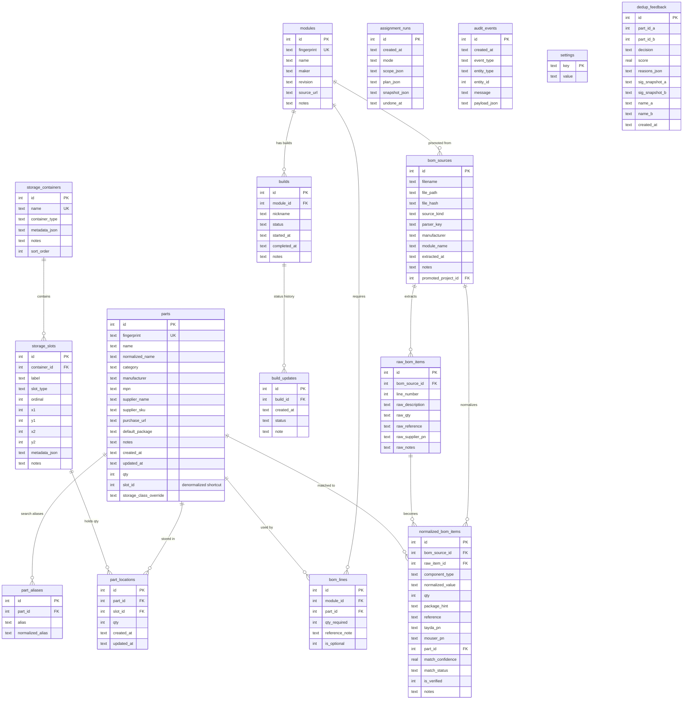

# Database Design

This document describes the current SQLite schema used by Simple DIY Electronics Inventory.

It is intended to answer three questions:

1. what data is stored
2. how tables relate to each other
3. which parts of the schema are canonical versus denormalized for UI convenience

The schema described here reflects the current migration set in [`src/eurorack_inventory/db/migrations`](/Users/danielmiller/dev/projects/simple-diy-synth-inventory/src/eurorack_inventory/db/migrations).

## Design Goals

- keep all application state in one local SQLite file
- make physical storage a first-class concept
- preserve a clear separation between canonical entities and derived UI summaries
- support safe schema evolution with append-only SQL migrations
- prefer explicit SQL and foreign keys over ORM abstraction

## Current Design At A Glance

- `parts` is the canonical component catalog.
- `part_locations` is the authoritative physical placement table.
- `part_aliases` extends searchability without duplicating parts.
- `storage_containers` and `storage_slots` model the physical workshop layout.
- `modules`, `bom_lines`, `builds`, and `build_updates` support project/build workflows.
- `bom_sources`, `raw_bom_items`, and `normalized_bom_items` support BOM ingestion and matching.
- `assignment_runs`, `audit_events`, `settings`, and `dedup_feedback` support operational workflows and observability.
- `part_inventory_summary` is a read-only view used for fast UI hydration.

## Graphic

## Core Inventory Model

### `parts`

`parts` stores the canonical component record.

Important characteristics:

- one row per logical part
- `fingerprint` is the durable dedup/upsert identity
- `qty` is the total quantity across all locations
- `slot_id` is no longer authoritative for storage
- `storage_class_override` stores user-directed assignment behavior

`slot_id` is intentionally retained as a denormalized convenience field:

- single assigned real slot: `slot_id` points at that slot
- only `Unassigned / Main`: `slot_id` is `NULL`
- split across multiple locations: `slot_id` is `NULL`

That keeps older UI and service paths simple while `part_locations` remains the source of truth.

### `part_aliases`

`part_aliases` supports alternate searchable names without cloning parts.

Examples:

- supplier shorthand
- common part nicknames
- imported alternate labels

Key constraint:

- `(part_id, normalized_alias)` is unique

### `part_locations`

`part_locations` is the authoritative placement table.

It models:

- one part in one slot
- quantity held at that slot
- multi-location inventory
- explicit unassigned stock via `Unassigned / Main`

Key constraint:

- `(part_id, slot_id)` is unique

That means one part can appear in many slots, but only once per slot.

## Physical Storage Model

### `storage_containers`

Top-level physical groupings such as:

- grid boxes
- binders
- drawers
- bins

`metadata_json` stores container-type-specific configuration such as grid dimensions.

### `storage_slots`

Child storage units inside a container.

Depending on `slot_type`, a row may represent:

- a normal grid cell
- a merged grid region
- a binder card
- a generic slot
- a bulk bin area such as `Unassigned / Main`

Coordinate fields `x1`, `y1`, `x2`, `y2` are only meaningful for grid-style storage.

`metadata_json` stores slot-specific details such as:

- `cell_size`
- `cell_length`
- `bag_count`

## Project / BOM / Build Model

### `modules`

This table stores what the UI calls projects.

The persisted table name remains `modules`, but in the Python domain model this is represented by `Project`.

### `bom_lines`

Join table between projects and parts.

Each row answers:

- which part is needed
- how many are required
- whether it is optional
- any reference note from the BOM

### `builds`

Concrete build instances of a project.

Used for:

- per-build status
- optional nickname
- lifecycle timestamps

### `build_updates`

Append-only build progress notes/status changes tied to a single build.

## BOM Extraction / Matching Model

### `bom_sources`

Represents an imported BOM source file and extraction run metadata.

### `raw_bom_items`

Stores literal extracted rows before normalization.

### `normalized_bom_items`

Stores cleaned BOM rows suitable for matching against inventory.

This is where the app tracks:

- normalized value
- inferred component type
- package hints
- linked `part_id`
- match confidence and verification state

## Operational / Supporting Tables

### `assignment_runs`

Persists assignment execution history so the app can:

- preview and apply assignment plans
- snapshot original placements
- support undo

The important JSON fields are:

- `scope_json`: which parts/containers/categories were in scope
- `plan_json`: what the assignment planned to place
- `snapshot_json`: the original placement state used for undo

### `audit_events`

Append-only operational log for user-visible changes.

This is not a debugging log; it is a persistent business-event trail.

### `settings`

Simple key/value storage for app configuration.

### `dedup_feedback`

Stores user decisions from duplicate review so merge/not-duplicate judgments survive future sessions.

Notably, `part_id_a` and `part_id_b` are stored as plain ids rather than foreign keys. That lets historical review records survive even if parts are later merged or removed.

## Derived Objects

### `part_inventory_summary`

This is a read-only SQL view used by the inventory UI.

It joins:

- `parts`
- `part_locations`
- `storage_slots`
- `storage_containers`

Its purpose is fast inventory-table hydration with preformatted location summaries such as:

- `Box 1 / A0 (40) +1 more`
- `Binder A / Card 3 (10)`

This is a convenience layer, not a source of truth.

## Canonical vs Denormalized Data

The most important structural rule in the current schema is:

- canonical placement data lives in `part_locations`

The following fields are derived or denormalized:

- `parts.qty`: aggregate total across placements
- `parts.slot_id`: shortcut for simple single-location cases
- `part_inventory_summary.locations`: formatted display string

This gives the app a nice compromise:

- normalized writes
- simpler reads for common UI paths

## Referential Integrity Rules

Key delete/update behaviors:

- deleting a part cascades to `part_aliases` and `part_locations`
- deleting a storage container cascades to `storage_slots`
- deleting a slot is restricted if `part_locations` still points at it
- deleting a project cascades to `bom_lines` and `builds`
- deleting a build cascades to `build_updates`
- deleting a BOM source cascades to raw/normalized extracted rows
- `normalized_bom_items.part_id` is `SET NULL`, so matched BOM rows survive part deletion

## Storage Rules Encoded In Schema Plus Services

The schema establishes structure, but several important rules are enforced in services rather than SQL alone:

- box/grid cells are treated as exclusive placement slots
- binder cards allow multiple parts up to `bag_count`
- merged cells may preserve one occupied source cell but never combine two occupied cells
- quantities across `part_locations` must sum to `parts.qty`
- explicit unassigned stock is stored in `Unassigned / Main`

These behaviors live in the repository/service layer on top of the schema.

## Migration History Summary

The current design is the result of a few important shifts:

### `001_initial.sql`

- introduced `parts`, `part_aliases`, storage tables, build tables, audit, and an initial lot-based model via `stock_lots`

### `002_remove_lots.sql`

- collapsed `stock_lots` into `parts.qty` and `parts.slot_id`

### `004_assignment_runs.sql`

- added assignment persistence and `storage_class_override`

### `006_bom_extraction.sql`

- added BOM source extraction and normalization tables

### `008_dedup_feedback.sql`

- added persisted dedup review decisions

### `009_part_locations.sql`

- reintroduced normalized multi-location storage using `part_locations`
- backfilled existing `parts.slot_id`
- created the default `Unassigned / Main`
- rebuilt `part_inventory_summary` around `part_locations`

## Practical Read Paths

Typical app reads follow these shapes:

### Inventory table

1. read `parts`
2. aggregate locations through `part_locations`
3. join slot/container names
4. return `InventorySummary`

### Find in storage

1. load `part_locations` for a part
2. branch on number of effective rows
3. direct jump for one real location
4. menu chooser for split quantity

### Storage screen

1. load slots for a container
2. load per-slot parts via `part_locations`
3. render slot-specific quantity in each visual cell

## Practical Write Paths

Typical writes follow these shapes:

### Move a part

1. determine target slot behavior
2. bump or reject conflicting occupants when needed
3. update `part_locations`
4. sync denormalized `parts.slot_id`
5. write an audit event

### Edit locations

1. validate location quantities against `parts.qty`
2. normalize duplicate slot rows
3. write `part_locations`
4. recompute `parts.slot_id`
5. refresh summary reads

### Merge duplicate parts

1. merge metadata into keeper row
2. union `part_locations`
3. sum per-slot quantities when both parts already occupy the same slot
4. delete removed part

## Known Naming Quirks

- the UI speaks in terms of projects, but the SQL table is still `modules`
- `parts.slot_id` looks authoritative at first glance, but it is not

These are intentional compatibility compromises, not accidents.

## Recommended Mental Model

If you only remember one rule, use this one:

> `parts` describes what a component is; `part_locations` describes where its quantity physically lives.
